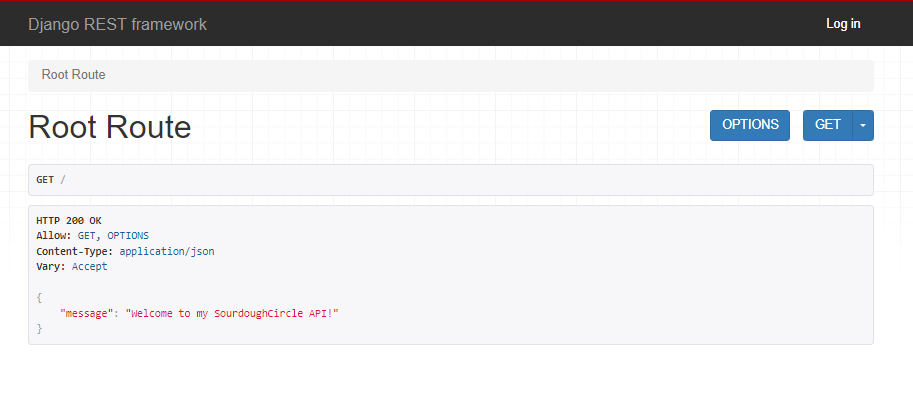
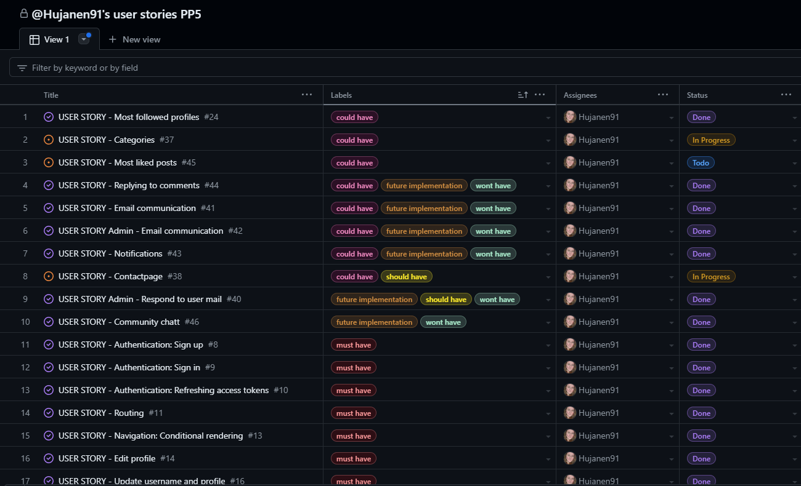
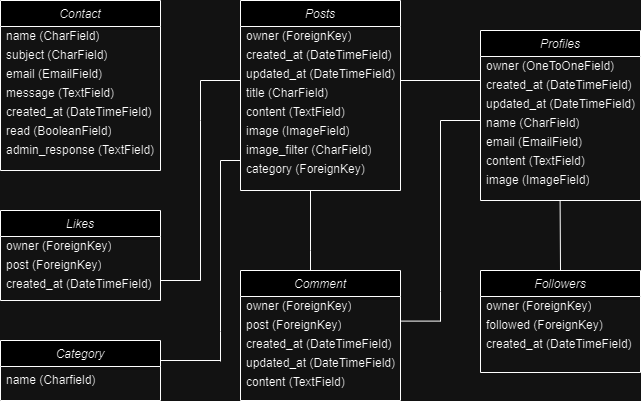
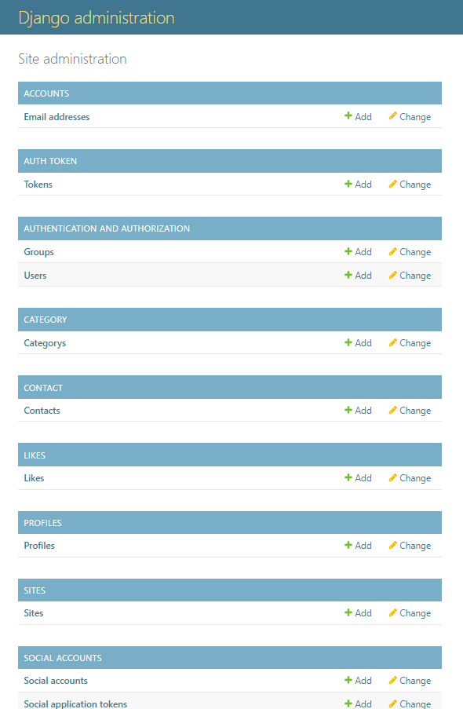

# SourdoughCircle API

<br>
SourdoughCircle is a social media platform that allows authenticated members to post images and share their content related to sourdough with other people. Members can post, like posts, comment on posts, and also edit and delete their posts. Members can also follow other members to create a personalized feed.

## Objective
This is the API for the SourdoughCircle FrontEnd application.
Here the backend information such as users, profiles, posts, comments, likes, categories etc are stored.

### React Frontend
The repository for the frontend of the application can be found here:<br>[SourdoughCircle FrontEnd](https://github.com/Hujanen91/sourdoughcircle_frontend)

## Live Page
[SourdoughCircle API](https://sourdoughcircle-api-382dc0f20c45.herokuapp.com/)




# Planning & Agile:
The API and Frontend of this project was planned using Agile methodology and MoSCoW prioritization on github projects.<br>

The user stories project can be found [here](https://github.com/users/Hujanen91/projects/9) 

## Labels used:
`must have`
`should have`
`could have`
`wont have`
`future implementation`
`has been implemented`<br>

For this purpose, the project was illustrated by [13 initial Milestone](https://github.com/Hujanen91/sourdoughcircle_frontend/milestones) entitled "Profiles", "Posts", "Likes", "Comments", "Category", "Followers", "Admin", "Contact", "Community Chat", "Authentication", "Routing", "Notifications" and "Navigation" providing the developer with the freedom to accomplish all issues/tasks flexibly before dates deadline set to June. The Milestones were broken according to their components name main functions.

Throughout the development process, new milestones were added, where tasks started from "Todo," progressing to "In Progress," and finally "Done". The issues were assigned to the sole developer and labeled as "could-have," "should-have,", "must-have", "won't-have" and later on labels like "has been implemented" and "future implementation" was also added.



## User Stories
### `Must-Have`:<br>
Follow/Unfollow [#17](https://github.com/Hujanen91/sourdoughcircle_frontend/issues/17)<br>
Edit a comment [#25](https://github.com/Hujanen91/sourdoughcircle_frontend/issues/25)<br>
Authentication: Sign up [#8]()<br>
Authentication: Sign in [#9]()<br>
Authentication: Refreshing access tokens [#10]()<br>
Routing [#11]()<br>
Navigation: Conditional rendering [#13]()<br>
Edit profile [#14]()<br>
Update username and profile [#16]()<br>
Edit post [#18]()<br>
Create a comment [#19]()<br>
Create posts [#20]()<br>
Post page [#21]()<br>
View recent posts [#28]()<br>
Like a post [#29]()<br>
Delete comments [#32]()<br>
View comments [#33]()<br>
View a post [#35]()<br>
Navigation [#36]()<br>

### `Should-Have`:<br>
User profile stats [#12]()<br>
View specific users posts [#15]()<br>
Profile page [#7]()<br>
Basic profile information [#22]()<br>
View liked posts [#23]()<br>
Avatar [#26]()<br>
Comment date [#27]()<br>
View posts of followed users [#30]()<br>
Infinite scroll [#31]()<br>
Search posts [#34]()<br>
Social media links in profile [#39]()<br>
Follow/Unfollow [#17](https://github.com/Hujanen91/sourdoughcircle_frontend/issues/17)<br>
Edit a comment [#25](https://github.com/Hujanen91/sourdoughcircle_frontend/issues/25)<br>
Admin - Respond to user mail [#40]()<br>
Contactpage [#38]()<br>

### `Could-Have`:<br>
Contactpage [#38]()<br>
Replying to comments [#44]()<br>
User - Email communication [#41]()<br>
Admin - Email communication [#42]()<br>
Notifications [#43]()<br>
Most followed profiles [#24]()<br>
Categories [#37]()<br>
Most liked posts [#45]()<br>

### `Wont-Have` & `Future implementation`:<br>
Replying to comments [#44]()<br>
User - Email communication [#41]()<br>
Admin - Email communication [#42]()<br>
Notifications [#43]()<br>
Admin - Respond to user mail [#40]()<br>
Community chat [#46]()<br>


<b>The issues were closed and the milestones subsequently too.</b>

## Relationship Diagram
The relationship diagram between models from an individual perspective can be best defined as follows:

- The [Profile](https://github.com/Hujanen91/sourdoughcircle_api/blob/main/profiles/models.py) flaunts the owner(OneToOne),<br>
 created_at(DateTimeField),<br>
 updated_at(DateTimeField),<br>
 name(CharField),<br>
 email(EmailField),<br>
 content(TextField),<br>
 image(ImageField),<br>
 facebook_link(URLField),<br>
 twitter_link(URLField) and<br>
 instagram_field(URLField)<br>

- A [Post](https://github.com/Hujanen91/sourdoughcircle_api/tree/main/posts/models.py) 
created by a User Profile, features:<br>
owner(ForeignKey),<br> 
created_at(DateTimeField),<br> 
updated_at(DateTimeField),<br> 
title(CharField),<br> 
content(TextField),<br>
image(ImageField),<br>
image_filter(CharField) once submited and<br>
category(ForeignKey)<br>

- The [Comments](https://github.com/Hujanen91/sourdoughcircle_api/blob/main/comments/models.py) model takes a similar approach,<br> 
inheriting the post(ForeignKey) and owner(ForeignKey),<br> 
it displays the content(TextField),<br>
created_at(DateTimeField), <br>
updated_at(DateTimeField) of the comment

- The [Likes](https://github.com/Hujanen91/sourdoughcircle_api/blob/main/likes/models.py) marked by the owner(ForeignKey),<br> 
post(ForeignKey) and <br>
created_at(DateTimeField)

- The [Follower](https://github.com/Hujanen91/sourdoughcircle_api/blob/main/followers/models.py) defined by owner(ForeignKey),<br> 
followed(ForeignKey),<br>
created_at(DateTimeField)

- Then the [Category](https://github.com/Hujanen91/sourdoughcircle_api/blob/main/category/models.py)<br>
 name(CharField) stores the categories added in the api to fetch in the frontend of the application to be used as one category to many posts.

- The [Contact](https://github.com/Hujanen91/sourdoughcircle_api/blob/main/contact/models.py) form finally isolated makes use of the name(CharField) and<br>
email(EmailField), <br>
subject(Charfield),<br> 
message(TextField),<br>
created_at(DateTimeField),<br>
read(BooleanField),<br>
admin_response(TextField)

***
<br>

Under Barker's notation:
One/Many Users can create multiple <i>Profiles</i>, which can then create many <i>Posts</i>.

Many <i>Comments</i> can be created in many <i>Posts</i> by one/many <i>Profiles</i>. 

One <i>Likes/Unlikes</i> can be created in many <i>Posts</i> by one/many <i>Profiles</i>.

One/Many <i>Profiles</i> can follow/unfollow many <i>Profiles</i>.

One <i>Category</i> can be connected to many <i>Posts</i>.

<i>Contacts</i> should be considered an isolated model as it is accessible by anyone, ergo many users.



## Methodology CRUD
When performing CRUD (Create, Retrieve, Update, Delete) function based views, the following methods were used to manipulate the table in the database.

For such, to the subsequent endpoints:
/profiles/, /posts/, /comments/, /likes/, /followers/, /contact/, /category/

- POST - Used to create an object to a list of (endpoint)
- GET - Used to retrieve series of objects from a list of (endpoint)

Singularly, for the same endpoints past the primary keys:
/profiles/int:pk/, /posts/int:pk/int:pk/, /comments/int:pk/, /likes/int:pk/, /followers/int:pk/, /contact/int:pk/, category/

- GET - Used to view a single object in a list or (endpoint)
- PUT - Used to update a single object in a list of (endpoint)
- DELETE - Used to delete an existant single object from a list of (endpoint)

Users can then:
- CRUD Profiles
- CRUD Posts
- CRUD Comments
- CRUD Likes
- CRUD Followers
- CR Contacts
- R Category

## Features and Functionality for Superusers

As a Superuser one has the ability to perform the following via the admin panel:
- CRUD Posts
- CRUD Comments
- CRUD Profiles
- CRUD Contacts
- CRUD Category
- Change Passwords
- Change emails
- Promote users to Superuser



# Manual Testing

<!-- Add Manual testing cases here with more detailed descriptions -->
Manual Testing for the overall functionality of the API was performed by entering dummy data in the backend both via Backend-and Front-end.
All data is CRUDed accordingly.


CI Python Linter was also used in parallel with the development of the API, to keep the code free of errors.

<!-- The Code has not exhibited apparent errors after consecutive tests and corrections throughout the development. Test Commits were exectuted in attempts to test the responsivness with the Front and the deployed Back-end. -->


## Future Improvements


## Installed Python Packages
The following packages were installed when developing this project:
To install, the following command ran: ```pip install``` ...
- ```cloudinary==1.40.0``` <- Cloudinary - cloud-based image and video host
- ```dj-database-url==0.5.0``` <- Utility library for Django
- ```dj-rest-auth==2.1.9``` <- Authentication functionality for DjangoRESTFramework-based APIs
- ```Django==4.2``` <- Python web framework
- ```django-allauth==0.44.0``` <- Extension for Django to a customizable authentication system
- ```django-cloudinary-storage==0.3.0``` <- Cloudinary - Backend storage for static media files
- ```django-cors-headers==3.7.0``` <- Middleware Cross-Origin Resource Sharing (CORS)
- ```django-filter==2.4.0``` <- Package to simplify filtering QuerySets
- ```django-heroku==0.3.1``` <- Python package toolkit to make deployment to Heroku easier. Was installed primary to fix issues with the css and js not working on admin panel.
- ```djangorestframework==3.15.1``` <- Toolkit for building Web APIs
- ```djangorestframework-simplejwt==5.3.1``` <- Extension that provides JSON Web Token (JWT) authentication
- ```gunicorn==22.0.0``` <- WSGI HTTP server for running Python web applications
- ```Pillow==10.3.0``` <- Python Imaging Library
- ```psycopg2==2.9.9``` <- PostgreSQL adapter for Python
- ```PyJWT==2.8.0``` <- Library for working with JSON Web Tokens (JWT)

## Package Dependencies
- asgiref==3.8.1
- oauthlib==3.2.2
- python3-openid==3.2.0
- pytz==2024.1
- requests-oauthlib==2.0.0
- sqlparse==0.5.0
- whitenoise==6.6.0

# Development & Deployment
The project was developed using GitHub and GitPod platforms...
- Navigate to: "Repositories" and create "New".
- Mark the following field: ✓ Public
- Select template: "Code-Institute-Org/react-ci-template".
- Add a Repository name: "sourdoughcircle-api".
- ...and create Repository.


For Commits on this project, the following commands ran:
- ```git add .``` <- Stages before commiting.
- ```git commit -m "written imperative declaration"``` <- Declares changes and updates.
- ```git push``` <- Push all updates to the GitHub Repository.

To run the server locally (Debug = True), the following command ran:
- ```python manage.py runserver``` <- Loads the website on the in-built Terminal.

During development migrations to the database were made.
To make migrations the following commands ran:
- ```python manage.py makemigrations``` <- Creates a new database migration
- ```python manage.py migrate``` <- Applies pending migrations

To create or update Requirements.txt file the following commands ran:
- ```pip3 freeze --local > requirements.txt```  <-Runs the req.
- ```pip install -r requirements.txt``` <- Install req.

To create a Superuser the following command ran (from Heroku terminal): 
- ```python manage.py createsuperuser``` (username->email->password1->password2) <- Creates a Superuser

To create a new Django project, in the currenct directory, the followig command ran:
- ```django-admin startproject NAMEOFTHEPROJECT .``` <- Starts the project

To create the app the following command ran:
- ```python3 manage.py startapp NAMOFTHEAPP``` <- Creates a folder for the app withing the project
- 
The website is being hosted and deployed on Heroku:
- Navigate to: "Create new app" add a unique name "djangorestframework-api" and select your region. Click "Create App"
- Head over to "Settings" tab and apply the respective config VARs
- Move to "Deploy" section and select "Github" method"
- From here search for the repository name "connect", from the GitHub account.
- Hit "Connect" and "Enable Automatic Deploys" to keep the the repository in parallel to Heroku.
- Manually "Deploy Main Branch".
- Upon successful deployment, retrieve the link for the mock terminal.
- The live app can be found [here](https://sourdoughcircle-api-382dc0f20c45.herokuapp.com/).

## Languages & Technologies
- Django REST Framework (Python Framework - API)

## Other forms of development
- [Diagrams](https://app.diagrams.net/) - Diagram set up
- [Github](https://github.com/) - Host for the repository
- [Gitpod](https://gitpod.io/) - Code editor
- [ElephantSQL](https://www.elephantsql.com/) - Database
- [Cloudinary](https://cloudinary.com/) - Static & Media host
- [Heroku](https://id.heroku.com/) - Cloud platform/Host the live project

## Credits
The following sources and references were resorted for the creation of this website:

- The lessons and tutorials provided by Code Institute, on the final module entitled "Django REST Framework" for the 'Advanced Front-End' specialization
- contact response code API:
https://stackoverflow.com/questions/68092438/def-update-creates-a-new-one-but-does-not-update-django
- SourdoughCircle icons:
https://www.flaticon.com/authors/mangsaabguru
- Other Icons:
https://www.flaticon.com
- I have been getting insperation from following users:<br>
[Gareth McGirr](https://github.com/Gareth-McGirr),<br>
[Hannibani](https://github.com/Haniibani),<br>
[TiagoMA90](https://github.com/TiagoMA90),<br>
[Cushione](https://github.com/Cushione)


## A big thank you to:
- My mentor [Gareth McGirr](https://github.com/Gareth-McGirr) for his continuing support and great advice throughout this project and all my other projects in this entire course at Code Institute.

- The Code Institute community at Slack that always have people ready to help and more specific the #community-sweden channel with all the amazing people that I have both talked to in the channels but also met in real life for some irl study sessions, you guys are amazing and made this entire course easier and more fun to push through!
