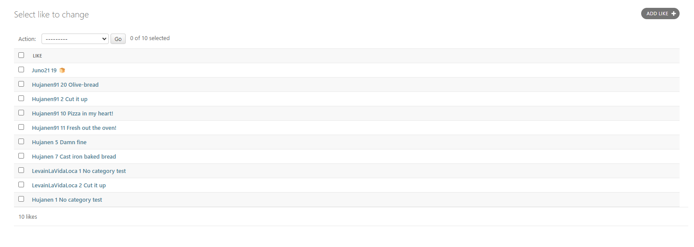
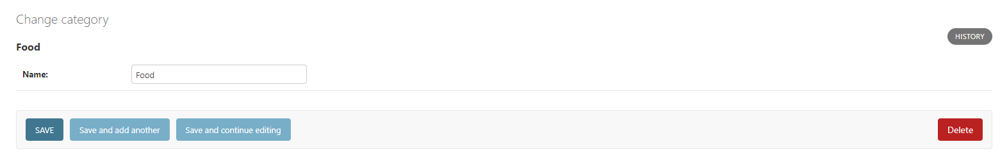
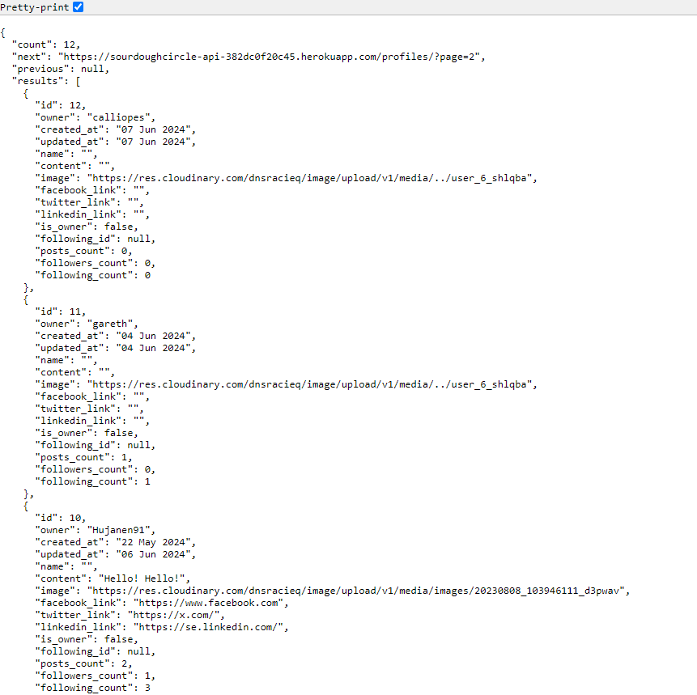

# SourdoughCircle API

<br>
SourdoughCircle is a social media platform that allows authenticated members to post images and share their content related to sourdough with other people. Members can post, like posts, comment on posts, and also edit and delete their posts. Members can also follow other members to create a personalized feed.

## Table of Contents
* [SourdoughCircle API](#Sourdoughcircle-api)
  * [Objective](#Objective)
    * [React Frontend](#React-Frontend)
  * [Live page](#Live-Page)
* [Planning & Agile](#Planning-and-Agile)
  * [Design](#Design)
  * [Wireframes](#Wireframes)
  * [Agile](#Agile)
  * [Labels used](#Labels-used)
  * [User stories](#User-stories)
  * [Relationship Diagram](#Relationship-Diagram)
  * [Methodology CRUD](#Methodology-CRUD)
  * [Features and Functionality for Superusers](#Features-and-Functionality-for-Superusers)
* [Manual Testing](#Manual-testing)
  * [Deployed Admin Screens](#deployed-admin-screens)
  * [Validation](#validation)
  * [Future Improvements](#Future-Improvements)
  * [Installed Python Packages](#Installed-Python-Packages)
  * [Package Dependencies](#Package-Dependencies)
* [Development and Deployment](#Development-and-Deployment)
  * [Heroku](#Heroku)
  * [Forking](#Forking)
  * [Languages and Technologies](#Languages-and-Technologies)
  * [Other forms of development](#Other-forms-of-development)
* [Credits](#Credits)
  * [Media](#Media)
* [Acknowledgements](#Acknowledgements)

## Objective
This is the API for the SourdoughCircle FrontEnd application.
Here the backend information such as users, profiles, posts, comments, likes, categories etc are stored.

### React Frontend
The repository for the frontend of the application can be found here:<br>[SourdoughCircle FrontEnd](https://github.com/Hujanen91/sourdoughcircle_frontend)

## Live Page
[SourdoughCircle API](https://sourdoughcircle-api-382dc0f20c45.herokuapp.com/)


# Planning and Agile

## Design:
The website was crafted to provide a visually appealing and user-friendly experience for sharing, liking, commenting, navigating, and browsing images of sourdough baked goods.
All the components are easely accessed and lets users perform all CRUD functionalities for everything they create on the site such as Comments, Likes, Profiles, Posts etc.

The Icons are playful and cartoonish to create a fun feeling of the site and the colors go hand in hand with the colors of the bread icons related to sourdough.

## Wireframes:
### Homescreen/Feed

### Liked posts page

### Login page

### Profile page

### Saved posts page (was later removed during planning)

### Signup page


## Agile:
The API and Frontend of this project was planned using Agile methodology and MoSCoW prioritization on github projects.<br>

The user stories project can be found [here](https://github.com/users/Hujanen91/projects/9) 

## Labels used:
`must have`
`should have`
`could have`
`wont have`
`future implementation`
`has been implemented`<br>

For this purpose, the project was illustrated by [13 initial Milestone](https://github.com/Hujanen91/sourdoughcircle_frontend/milestones) entitled "Profiles", "Posts", "Likes", "Comments", "Category", "Followers", "Admin", "Contact", "Community Chat", "Authentication", "Routing", "Notifications" and "Navigation" providing the developer with the freedom to accomplish all issues/tasks flexibly before dates deadline set to June. The Milestones were broken according to their components name main functions.

Throughout the development process, new milestones were added, where tasks started from "Todo," progressing to "In Progress," and finally "Done". The issues were assigned to the sole developer and labeled as "could-have," "should-have,", "must-have", "won't-have" and later on labels like "has been implemented" and "future implementation" was also added.


## User Stories
### `Must-Have`:<br>
Follow/Unfollow [#17](https://github.com/Hujanen91/sourdoughcircle_frontend/issues/17)<br>
Edit a comment [#25](https://github.com/Hujanen91/sourdoughcircle_frontend/issues/25)<br>
Authentication: Sign up [#8]()<br>
Authentication: Sign in [#9]()<br>
Authentication: Refreshing access tokens [#10]()<br>
Routing [#11]()<br>
Navigation: Conditional rendering [#13]()<br>
Edit profile [#14]()<br>
Update username and profile [#16]()<br>
Edit post [#18]()<br>
Create a comment [#19]()<br>
Create posts [#20]()<br>
Post page [#21]()<br>
View recent posts [#28]()<br>
Like a post [#29]()<br>
Delete comments [#32]()<br>
View comments [#33]()<br>
View a post [#35]()<br>
Navigation [#36]()<br>

### `Should-Have`:<br>
User profile stats [#12]()<br>
View specific users posts [#15]()<br>
Profile page [#7]()<br>
Basic profile information [#22]()<br>
View liked posts [#23]()<br>
Avatar [#26]()<br>
Comment date [#27]()<br>
View posts of followed users [#30]()<br>
Infinite scroll [#31]()<br>
Search posts [#34]()<br>
Social media links in profile [#39]()<br>
Follow/Unfollow [#17](https://github.com/Hujanen91/sourdoughcircle_frontend/issues/17)<br>
Edit a comment [#25](https://github.com/Hujanen91/sourdoughcircle_frontend/issues/25)<br>
Admin - Respond to user mail [#40]()<br>
Contactpage [#38]()<br>

### `Could-Have`:<br>
Contactpage [#38]()<br>
Replying to comments [#44]()<br>
User - Email communication [#41]()<br>
Admin - Email communication [#42]()<br>
Notifications [#43]()<br>
Most followed profiles [#24]()<br>
Categories [#37]()<br>
Most liked posts [#45]()<br>

### `Wont-Have` & `Future implementation`:<br>
Replying to comments [#44]()<br>
User - Email communication [#41]()<br>
Admin - Email communication [#42]()<br>
Notifications [#43]()<br>
Admin - Respond to user mail [#40]()<br>
Community chat [#46]()<br>


<b>The issues were closed and the milestones subsequently too.</b>

## Relationship Diagram
The relationship diagram between models from an individual perspective can be best defined as follows:

- The [Profile](https://github.com/Hujanen91/sourdoughcircle_api/blob/main/profiles/models.py) flaunts the owner(OneToOne),<br>
 created_at(DateTimeField),<br>
 updated_at(DateTimeField),<br>
 name(CharField),<br>
 email(EmailField),<br>
 content(TextField),<br>
 image(ImageField),<br>
 facebook_link(URLField),<br>
 twitter_link(URLField) and<br>
 instagram_field(URLField)<br>

- A [Post](https://github.com/Hujanen91/sourdoughcircle_api/tree/main/posts/models.py) 
created by a User Profile, features:<br>
owner(ForeignKey),<br> 
created_at(DateTimeField),<br> 
updated_at(DateTimeField),<br> 
title(CharField),<br> 
content(TextField),<br>
image(ImageField),<br>
image_filter(CharField) once submited and<br>
category(ForeignKey)<br>

- The [Comments](https://github.com/Hujanen91/sourdoughcircle_api/blob/main/comments/models.py) model takes a similar approach,<br> 
inheriting the post(ForeignKey) and owner(ForeignKey),<br> 
it displays the content(TextField),<br>
created_at(DateTimeField), <br>
updated_at(DateTimeField) of the comment

- The [Likes](https://github.com/Hujanen91/sourdoughcircle_api/blob/main/likes/models.py) marked by the owner(ForeignKey),<br> 
post(ForeignKey) and <br>
created_at(DateTimeField)

- The [Follower](https://github.com/Hujanen91/sourdoughcircle_api/blob/main/followers/models.py) defined by owner(ForeignKey),<br> 
followed(ForeignKey),<br>
created_at(DateTimeField)

- Then the [Category](https://github.com/Hujanen91/sourdoughcircle_api/blob/main/category/models.py)<br>
 name(CharField) stores the categories added in the api to fetch in the frontend of the application to be used as one category to many posts.

- The [Contact](https://github.com/Hujanen91/sourdoughcircle_api/blob/main/contact/models.py) form finally isolated makes use of the name(CharField) and<br>
email(EmailField), <br>
subject(Charfield),<br> 
message(TextField),<br>
created_at(DateTimeField),<br>
read(BooleanField),<br>
admin_response(TextField)

***
<br>

Under Barker's notation:
One/Many Users can create multiple <i>Profiles</i>, which can then create many <i>Posts</i>.

Many <i>Comments</i> can be created in many <i>Posts</i> by one/many <i>Profiles</i>. 

One <i>Likes/Unlikes</i> can be created in many <i>Posts</i> by one/many <i>Profiles</i>.

One/Many <i>Profiles</i> can follow/unfollow many <i>Profiles</i>.

One <i>Category</i> can be connected to many <i>Posts</i>.

<i>Contacts</i> should be considered an isolated model as it is accessible by anyone, ergo many users.


## Methodology CRUD
When performing CRUD (Create, Retrieve, Update, Delete) function based views, the following methods were used to manipulate the table in the database.

For such, to the subsequent endpoints:
/profiles/, /posts/, /comments/, /likes/, /followers/, /contact/, /category/

- POST - Used to create an object to a list of (endpoint)
- GET - Used to retrieve series of objects from a list of (endpoint)

Singularly, for the same endpoints past the primary keys:
/profiles/int:pk/, /posts/int:pk/int:pk/, /comments/int:pk/, /likes/int:pk/, /followers/int:pk/, /contact/int:pk/, category/

- GET - Used to view a single object in a list or (endpoint)
- PUT - Used to update a single object in a list of (endpoint)
- DELETE - Used to delete an existant single object from a list of (endpoint)

Users can then:
- CRUD Profiles
- CRUD Posts
- CRUD Comments
- CRUD Likes
- CRUD Followers
- CR Contacts
- R Category

## Features and Functionality for Superusers

As a Superuser one has the ability to perform the following via the admin panel:
- CRUD Posts
- CRUD Comments
- CRUD Profiles
- CRUD Contacts
- CRUD Category
- Change Passwords
- Change emails
- Promote users to Superuser

<br>


# Manual Testing

Manual Testing for the overall functionality of the API was performed by entering dummy data in the backend both via Backend-and Front-end.
All data is CRUDed accordingly.<br>
<b>[Detailed manual testing is located here](/Testing.md)</b>

Screenshots have been taken borth in local production and in deployed version to display that everything is working as expected.
The screenshots during testing is taken in local production to more specifically show the auth and unauth results for the api and to properly display that everything is working. 
Images from the deployed api and the admin django panel can be found below in the <b>Deployed admin screens section:</b>


## Deployed admin Screens

<details>
<summary><b>Django admin panel</b></summary>
<summary>
<br>

  An overview of the django admin panel to display the different pathways and to inform what the admin can do.

  - <b>Profiles</b><br>
    The admin overview of all the profiles where admin can pick a profile and delete it (GET, POST and DELETE)
  
  - <b>Profiles details</b><br>
    Profile details, here the admin can change all the details in the profile as displayed in the image. The admin can also delete users. (GET, PUT, PATCH, DELETE)
  
  - <b>Posts</b><br>
    Postlist for admin to view and handle all the posts on the website (GET, POST and DELETE)
  
  - <b>Posts details</b><br>
    Post details admin view to make it easy for admin to handle the posts details. The admin can change all the details of the post and delete it if needed. (GET, PUT, PATCH and DELETE)
  
  - <b>Likes</b><br>
    Likes view that displays a list of the likes and what post that is liked (GET, POST, DELETE)
  
  - <b>Likes details</b><br>
    Details view for likes where admin can edit what posts the like should be connected to, the admin can also change user that liked and delete likes. (GET, PUT, PATCH and DELETE)
  
  - <b>Contact</b><br>
    Contact list view of all the incoming messages from the contact form on the website. Admin can create new contact and delete existing ones. (GET, POST, DELETE)
  
  - <b>Contact details</b><br>
    Admin contact details where admin can read the message and it's details, edit, add new information, and delete. An admin response field is also implemented but non working at the moment, this will be a [future improvement](#future-improvements) where admin is supposed to be able to respond directly on the admin panel and the email will be sent to the email the user added to the form. (GET, PUT, PATCH and DELETE)
  
  - <b>Comments</b><br>
    Comments list admin overview for the admin to see all the comments, add new ones and delete existing ones. (GET, POST and DELETE)
  
  - <b>Comments details</b><br>
    Details view for comments where admin can update all the fields needed for the comment, the admin can also delete the comment. (GET, PUT, PATCH and DELETE)
  
  - <b>Category</b><br>
    Category list view for admin to display all existing categories with id number and name. Admin can add new categories or delete existing ones. (GET, POST and DELETE)
  
  - <b>Category details</b><br>
    Details view for categories. The admin can update existing fields and delete if needed. (GET, PUT, PATCH and DELETE)
  


</summary>
</details>
<details>
<summary><b>Deployed API overview</b></summary>
<summary>
<br>

  Below are screenshots of the deployed API that displays the main overview and that the paths are working correctly and not displaying any sensitive information, the main testing was done in the local API to get more details and information when testing and can be found [here](#manual-testing) and the live API can be found [here](https://sourdoughcircle-api-382dc0f20c45.herokuapp.com)

  - [Start](https://sourdoughcircle-api-382dc0f20c45.herokuapp.com)<br>
    The main page of the deployed API
  
  - [/profiles](https://sourdoughcircle-api-382dc0f20c45.herokuapp.com/profiles)<br>
    The profile list on the deployed API
  
  - [/profiles/id](https://sourdoughcircle-api-382dc0f20c45.herokuapp.com/profiles/10)<br>
    The profile id view on the deployed API
  
  - [/posts](https://sourdoughcircle-api-382dc0f20c45.herokuapp.com/posts)<br>
    The posts list on the deployed API
  
  - [/posts/id](https://sourdoughcircle-api-382dc0f20c45.herokuapp.com/posts/20)<br>
    The posts id view on the deployed API
  
  - [/likes](https://sourdoughcircle-api-382dc0f20c45.herokuapp.com/likes)<br>
    The likes list on the deployed API
  
  - [/likes/id](https://sourdoughcircle-api-382dc0f20c45.herokuapp.com/likes/23)<br>
    The likes id view on the deployed API
  
  - [/contact (authentication required to display)](https://sourdoughcircle-api-382dc0f20c45.herokuapp.com/contact)<br>
    The contact list on the deployed API. This page should respond with non authenticated information to not give everyone access to users information and messages sent through with the contact form.
  
  - [/contact/id (authentication required to display)](https://sourdoughcircle-api-382dc0f20c45.herokuapp.com/contact/1)<br>
    The contact id view on the deployed API. This page should respond with non authenticated information to not give everyone access to users information and messages sent through with the contact form.
  
  - [/comments](https://sourdoughcircle-api-382dc0f20c45.herokuapp.com/comments)<br>
    The comments list on the deployed API.
  
  - [/comments/id](https://sourdoughcircle-api-382dc0f20c45.herokuapp.com/comments/22)<br>
    The comments id view on the deployed API.
  
  - [/category](https://sourdoughcircle-api-382dc0f20c45.herokuapp.com/category)<br>
    The category list on the deployed API.
  
   - [/category/id](https://sourdoughcircle-api-382dc0f20c45.herokuapp.com/category/19)<br>
    The category id view on the deployed API.
  

</summary>
</details>

## Validation
CI Python Linter was also used in parallel with the development of the API, to keep the code free of errors.

The Code has not exhibited apparent errors after consecutive tests and corrections throughout the development.
Minor errors was appearing in the validation but was simple to resolve:

<b>W291 trailing whitespace</b> - removed whitespace to resolve errror<br>
<b>W292 no newline at end of file</b> - added new line to resolve<br>
<b>W293 blank line containse whitespace</b> - removed whitespaces to resolve errors<br>
<b>E275 missing whitepace after keyword</b> - added whitespace to resolve<br>
<b>E231 missing whitespace after ','</b> - added whitespace to resolve<br>
<b>E201 whitespace after '{'</b> - removed whitespace to resolve error<br>
<b>E202 whitespace before '}'</b> - removed whitespace to resolve error<br>
<b>E501 line too long</b> - shortened string/removed whitespace/shortened the code to resolve<br>


After solving the minor errors above all python code in all apps are now All clear and without errors:

 

## Future Improvements
<b>Communication with user and admin:</b><br>

Add functions in Contact to make it able for admin to use the admin response field properly. This was not implemented fully in this project due to me not having enough time to try to make it work.<br>

<b>Community Chat:</b><br>
A community live chat displayed at all times on all pages of the website could be added in the future to make communication easier and more fun.

<b>Bookmarks:</b><br>
To make it easier for the user to save posts they like.

<b>Easier communication via contact form:</b><br>
Work on making the admin response fully functional to make the communication easier and faster. One solutions would be to add a page to the frontend for only admins where they can handle messages and contact with users directly in the fronend when logged in.

<b>Direct message:</b><br>
A fun way to communicate with other users, could also be used for easier communication with the admins instead of using direct emails.

<b>Notifications:</b><br>
Notifications for when the user gets likes, comments or even for admins to send out news alerts would make it easier to keep track of whats happening on every users account.


## Installed Python Packages
The following packages were installed when developing this project:
To install, the following command ran: ```pip install``` ...
- ```cloudinary==1.40.0``` <- Cloudinary - cloud-based image and video host
- ```dj-database-url==0.5.0``` <- Utility library for Django
- ```dj-rest-auth==2.1.9``` <- Authentication functionality for DjangoRESTFramework-based APIs
- ```Django==4.2``` <- Python web framework
- ```django-allauth==0.44.0``` <- Extension for Django to a customizable authentication system
- ```django-cloudinary-storage==0.3.0``` <- Cloudinary - Backend storage for static media files
- ```django-cors-headers==3.7.0``` <- Middleware Cross-Origin Resource Sharing (CORS)
- ```django-filter==2.4.0``` <- Package to simplify filtering QuerySets
- ```django-heroku==0.3.1``` <- Python package toolkit to make deployment to Heroku easier. Was installed primary to fix issues with the css and js not working on admin panel.
- ```djangorestframework==3.15.1``` <- Toolkit for building Web APIs
- ```djangorestframework-simplejwt==5.3.1``` <- Extension that provides JSON Web Token (JWT) authentication
- ```gunicorn==22.0.0``` <- WSGI HTTP server for running Python web applications
- ```Pillow==10.3.0``` <- Python Imaging Library
- ```psycopg2==2.9.9``` <- PostgreSQL adapter for Python
- ```PyJWT==2.8.0``` <- Library for working with JSON Web Tokens (JWT)

## Package Dependencies
- asgiref==3.8.1
- oauthlib==3.2.2
- python3-openid==3.2.0
- pytz==2024.1
- requests-oauthlib==2.0.0
- sqlparse==0.5.0
- whitenoise==6.6.0

# Development and Deployment
The project was developed using GitHub and GitPod platforms...
- Navigate to: "Repositories" and create "New".
- Mark the following field: ✓ Public
- Select template: "Code-Institute-Org/react-ci-template".
- Add a Repository name: "sourdoughcircle-api".
- ...and create Repository.


For Commits on this project, the following commands ran:
- ```git add .``` <- Stages before commiting.
- ```git commit -m "written imperative declaration"``` <- Declares changes and updates.
- ```git push``` <- Push all updates to the GitHub Repository.

To run the server locally (Debug = True), the following command ran:
- ```python manage.py runserver``` <- Loads the website on the in-built Terminal.

During development migrations to the database were made.
To make migrations the following commands ran:
- ```python manage.py makemigrations``` <- Creates a new database migration
- ```python manage.py migrate``` <- Applies pending migrations

To create or update Requirements.txt file the following commands ran:
- ```pip3 freeze --local > requirements.txt```  <-Runs the req.
- ```pip install -r requirements.txt``` <- Install req.

To create a Superuser the following command ran (from Heroku terminal): 
- ```python manage.py createsuperuser``` (username->email->password1->password2) <- Creates a Superuser

To create a new Django project, in the currenct directory, the followig command ran:
- ```django-admin startproject NAMEOFTHEPROJECT .``` <- Starts the project

To create the app the following command ran:
- ```python3 manage.py startapp NAMOFTHEAPP``` <- Creates a folder for the app withing the project
- 

## Heroku
The website is being hosted and deployed on Heroku:
- Navigate to: "Create new app" add a unique name "djangorestframework-api" and select your region. Click "Create App"
- Head over to "Settings" tab and apply the respective config VARs
- Move to "Deploy" section and select "Github" method"
- From here search for the repository name "connect", from the GitHub account.
- Hit "Connect" and "Enable Automatic Deploys" to keep the the repository in parallel to Heroku.
- Manually "Deploy Main Branch".
- Upon successful deployment, retrieve the link for the mock terminal.
- The live app can be found [here](https://sourdoughcircle-api-382dc0f20c45.herokuapp.com/).

## Forking
Most commonly, forks are used to either propose changes to someone else's project or to use someone else's project as a starting point for your own idea.

- Navigate to the GitHub Repository you want to 
  fork.

- On the top right of the page under the header, 
  click the fork button.

- This will create a duplicate of the full 
  project in your GitHub Repository.

## Languages and Technologies
- Django REST Framework (Python Framework - API)

## Other forms of development
- [Diagrams](https://app.diagrams.net/) - Diagram set up
- [Github](https://github.com/) - Host for the repository
- [Gitpod](https://gitpod.io/) - Code editor
- [ElephantSQL](https://www.elephantsql.com/) - Database
- [Cloudinary](https://cloudinary.com/) - Static & Media host
- [Heroku](https://id.heroku.com/) - Cloud platform/Host the live project

# Credits

The following sources and references were resorted for the creation of this website:

- The lessons and tutorials provided by Code Institute, on the final module entitled "Django REST Framework" for the 'Advanced Front-End' specialization
- contact response code API:
https://stackoverflow.com/questions/68092438/def-update-creates-a-new-one-but-does-not-update-django
- SourdoughCircle icons:
https://www.flaticon.com/authors/mangsaabguru
- Other Icons:
https://www.flaticon.com
- I have been getting insperation from following users:<br>
[Gareth McGirr](https://github.com/Gareth-McGirr),<br>
[Hannibani](https://github.com/Haniibani),<br>
[TiagoMA90](https://github.com/TiagoMA90),<br>
[Cushione](https://github.com/Cushione)

## Media:
- SourdoughCircle icons:
https://www.flaticon.com/authors/mangsaabguru
- Other Icons:
https://www.flaticon.com


# Acknowledgements
- My mentor [Gareth McGirr](https://github.com/Gareth-McGirr) for his continuing support and great advice throughout this project and all my other projects in this entire course at Code Institute.

- The Code Institute community at Slack that always have people ready to help and more specific the #community-sweden channel with all the amazing people that I have both talked to in the channels but also met in real life for some irl study sessions, you guys are amazing and made this entire course easier and more fun to push through!
